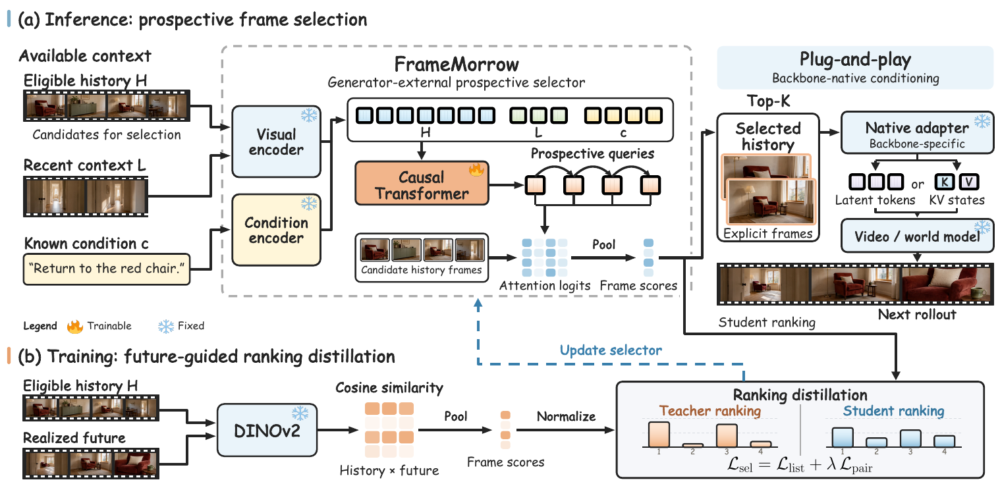
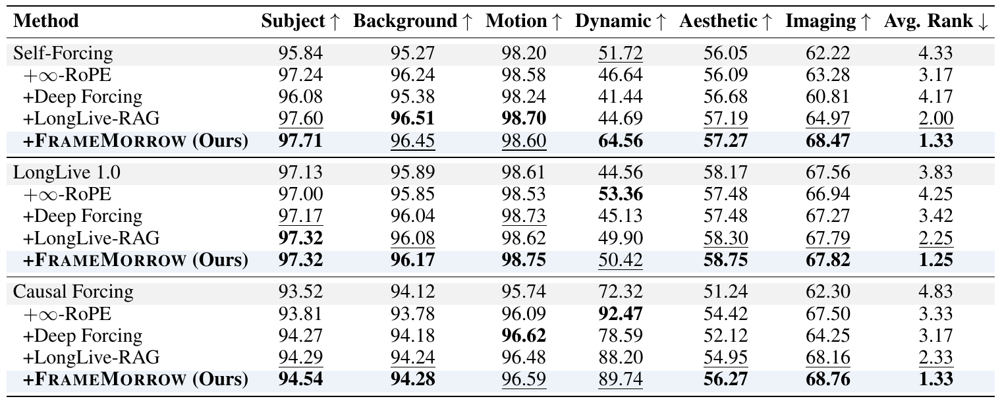
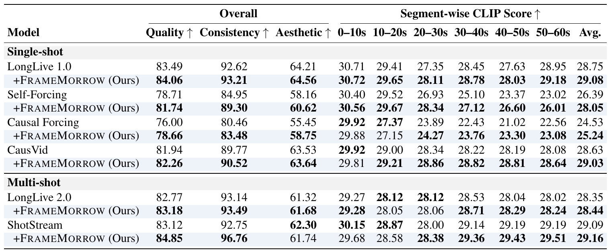
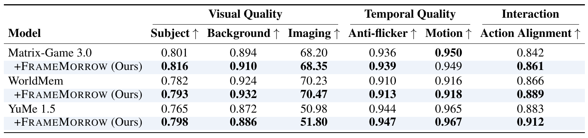

<div align="center">

# FrameMorrow: Future-Guided Frame Selection with Prospective Tokens for Long-Horizon Video Generation

<p>
  <a href="https://arxiv.org/abs/2609.38839"></a>
  <a href="https://yinbo0927.github.io/FrameMorrow/"></a>
  
</p>

<p>
  <a href="https://openreview.net/profile?id=~Bo_Yin2">Bo Yin</a>,
  <a href="https://openreview.net/profile?id=~Xiaobin_Hu1">Xiaobin Hu</a>,
  <a href="https://openreview.net/profile?id=~Jiaqi_Zhao3">Jiaqi Zhao</a>,
  <a href="https://openreview.net/profile?id=~Shuicheng_YAN3">Shuicheng Yan</a>
</p>

<p>Official repository for <strong>FrameMorrow</strong>. Code will be released soon.</p>

</div>

---

## Framework

<p align="center">
  
</p>

<p align="center">
  <em>FrameMorrow predicts prospective tokens to select historical frames for future generation. Explicit frames enable plug-and-play integration through each generator's existing conditioning interface.</em>
</p>

## Main Results

<p align="center"><strong>Long video generation on MovieGenBench.</strong></p>

<p align="center">
  
</p>

<br>

<p align="center"><strong>Interactive video generation under single-shot and multi-shot conditions.</strong></p>

<p align="center">
  
</p>

<br>

<p align="center"><strong>Action-conditioned interactive world models.</strong></p>

<p align="center">
  
</p>

## Citation

```bibtex
@article{yin2026framemorrow,
  title={FrameMorrow: Future-guided Frame Selection with Prospective Tokens for Long-Horizon Video Generation},
  author={Yin, Bo and Hu, Xiaobin and Zhao, Jiaqi and Yan, Shuicheng},
  journal={arXiv preprint arXiv:2609.38839},
  year={2026}
}
```

## Project Website

The website lives in [`docs/`](docs/). See its [README](docs/README.md) for local preview instructions.
